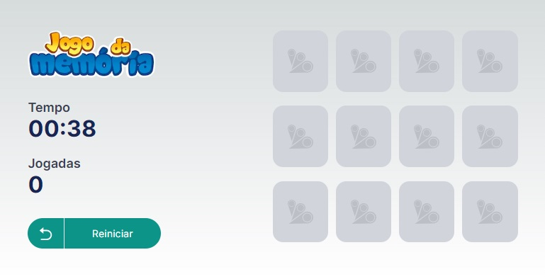

## Jogo da Memória

Jogo da memória com contador de tempo e de jogadas  feito em React (com Typescript e Tailwind CSS).

Instalação:

```bash
npm install
```

Para ligar o servidor:
```bash
npm run start
```

Com o servidor ligado clique em  [http://localhost:3000](http://localhost:3000) para acessar o jogo da memória.
.


